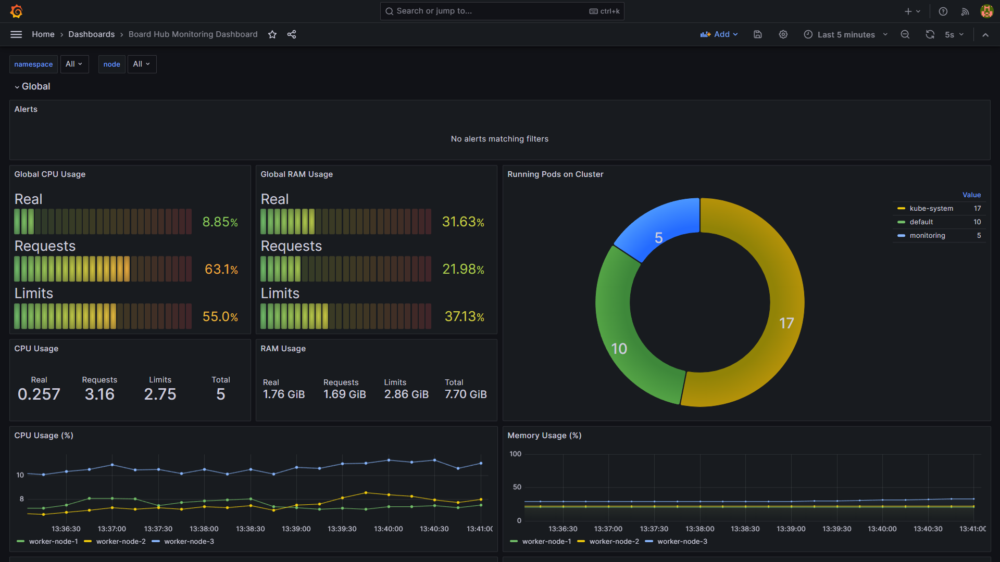
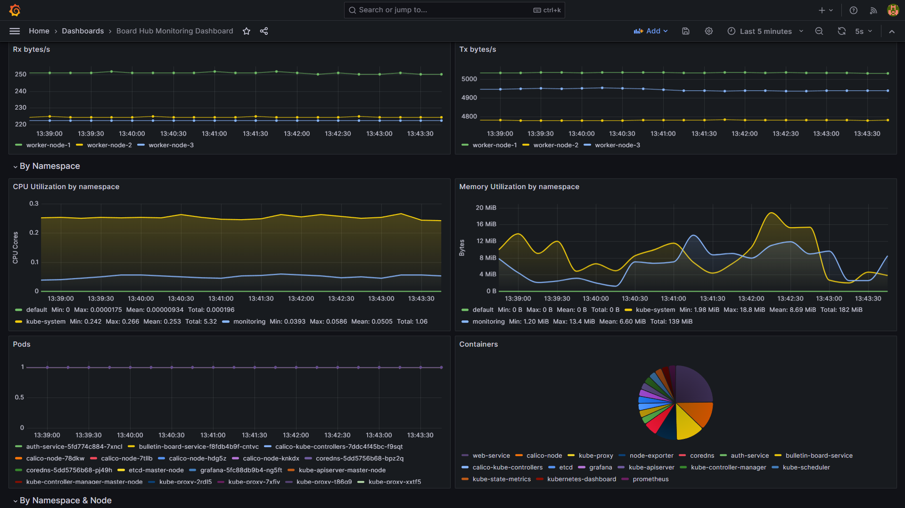
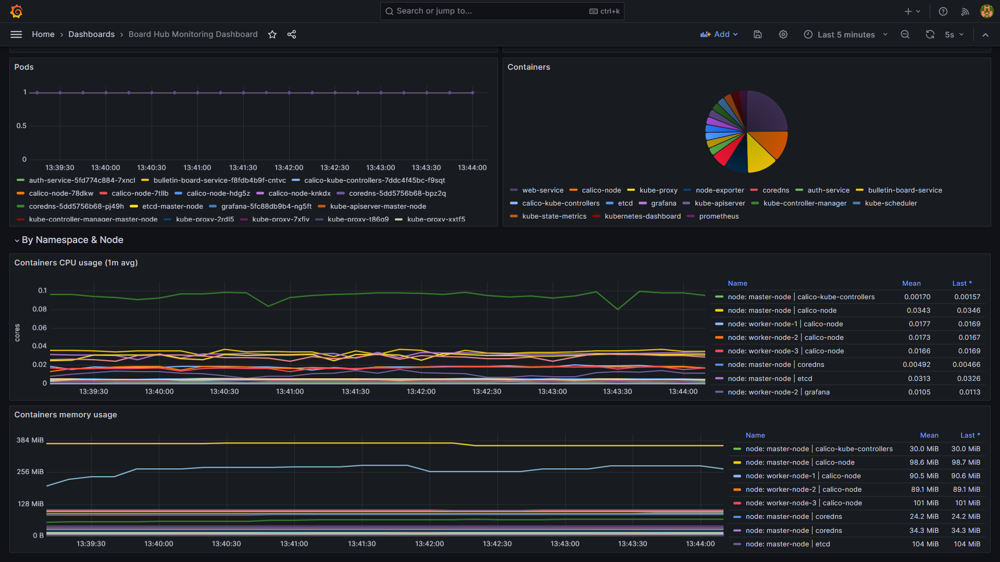

# Deployment


## Prerequisites

Make sure secrets are created before deploying the application.

Create private and public key for JWT authentication:
```
openssl ecparam -name prime256v1 -genkey -noout -out private.key

openssl ec -in private.key -pubout -out public.key
```

Create the secrets for the private and public key:
```
 kubectl create secret generic jwt-private-key --from-file private.key

 kubectl create secret generic jwt-public-key --from-file public.key
```

Create the secret for the postgres password:
```
kubectl create secret generic postgres-password --from-literal=POSTGRES_PASSWORD=password
```

Verify that all secrets are created:
```
kubectl get secrets

NAME                TYPE     DATA   AGE
jwt-private-key     Opaque   1      0m1s
jwt-public-key      Opaque   1      0m1s
postgres-password   Opaque   1      0m1s
```

<a id="metrics-server"></a>

### Metrics Server
The subfolder `metrics-server` contains the metrics-server deployment. This is required to get the CPU and RAM usage of the pods. This folder contains a modified version of the metrics-server deployment from the official [metrics-server repository](https://github.com/kubernetes-sigs/metrics-server?tab=readme-ov-file#kubernetes-metrics-server) with the `--kubelet-insecure-tls` flag being set. If you are using a different metrics-server deployment, make sure to exclude the `metrics-server` folder from the deployment.


## Deploy on Minikube

Make sure [Minikube](https://minikube.sigs.k8s.io/docs/start/) is properly installed and all secrets are created.

Run `minikube start` to start the cluster.

Enable ingress addon:

```
minikube addons enable ingress
```

> Note: Make sure you have read the [metrics-server](#metrics-server) section before continuing.

Enable metrics-server addon:

```
minikube addons enable metrics-server
```

Deploy the application:
```
kubectl apply -f k8s/manifests --recursive
```

Only in docker desktop: Run `minikube tunnel` to expose the ingress controller to the host. (see [Ingres documentation](https://minikube.sigs.k8s.io/docs/start/))

You can now access the application at [http://localhost:80](http://localhost:80).

## Deploy on other Kubernetes Cluster

Make sure you have a working Kubernetes cluster with an ingress controller running. See https://spacelift.io/blog/kubernetes-ingress on how to set up an ingress controller. In addition, make sure all secrets are created.

Deploy the application:

```
kubectl apply -f k8s/manifests --recursive
```

Run `kubectl get ingress` to get the ingress IP address.

Example:

```
❯ kubectl get ingress
NAME            CLASS   HOSTS   ADDRESS        PORTS   AGE
proxy-ingress   nginx   *       192.168.49.2   80      13m
```

Access the application at `http://<ingress-ip>:80`.

## Monitoring

### Overview

The application is monitored using Prometheus and Grafana. To access the monitoring dashboard, you need to deploy and configure the monitoring stack.
[Read the setup section.](#monitoring-setup)


First section of the dashboard shows some general resource metrics and an overview of the application pods per namespace.


Second section displays the inbound and outbound traffic of the application. In addition, a row containing metrics specific to the selected namespace is displayed.
It is possible to select a namespace from the dropdown menu, otherwise the metrics of all namespaces are displayed.


Last section displays metrics coupled to the namespace and node. In the same manner as the second section, it is possible to select a namespace from the dropdown menu as well as a node. If no node is selected, metrics of all nodes are displayed as well. This section is useful to check the resource usage of specific containers.


<a id="monitoring-setup"></a>
### Setup
#### Access grafana

Use the following command to get the grafana port:

```
❯ kubectl get service/grafana --namespace=monitoring
NAME      TYPE       CLUSTER-IP      EXTERNAL-IP   PORT(S)          AGE
grafana   NodePort   10.110.91.191   <none>        3000:32702/TCP   17h
```

When using minikube, run `minikube service grafana --namespace=monitoring` to open grafana in the browser.

Default grafana credentials are `admin` and `admin`.


#### Import dashboard

After the deployment is finished access the grafana dashboard and import the dashboard from `k8s/grafana/Board Hub Monitoring Dashboard.json`.

To import the dashboard:
1. go to `Dashboards` -> `New` -> `Import` and upload the json file.
2. Select the `Prometheus` data source.
3. Click `Import`.

The dashboard should now be available under `Dashboards` -> `Board Hub Monitoring Dashboard`.

### Alerts

The monitoring stack is set up with two alerts:

CPU Alerts under `Resource Alerts > CPU Alerts`
RAM Alerts under `Resource Alerts > RAM Alerts`
The CPU alert activates when the overall CPU usage surpasses 70% for a continuous period of 30 seconds, while the RAM alert triggers when the overall memory usage exceeds 70% for 30 seconds.
If an alert is triggerd, it shows up in the `Alerts` tab of the dashboard.

Provisioning for both alerts is done through alerting config map defined through the `k8s/manifests/monitoring/grafana/alerting.yaml` file.